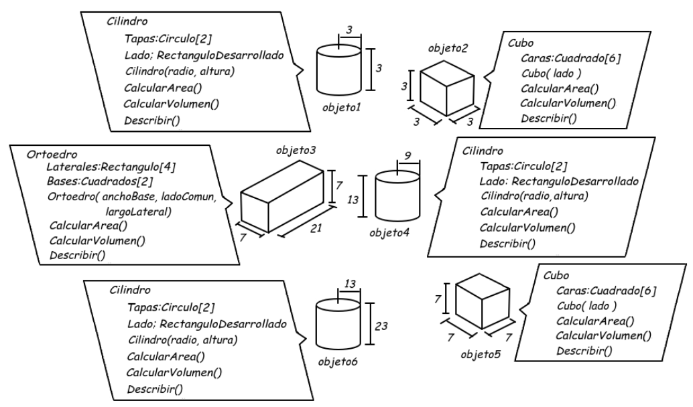

# Visor 3d. Actividad 1. Programación 2

## Documentos

[Documento de consulta](https://docs.google.com/document/d/15oooz_o_9PvNls22jXKH3T7hdWq1SsCE/preview)

## Actividad

[Actividad](https://docs.google.com/document/d/15oooz_o_9PvNls22jXKH3T7hdWq1SsCE/preview)

 

## Versiones

v9 corrección de atributo Tapas por Bases en ortoedro
